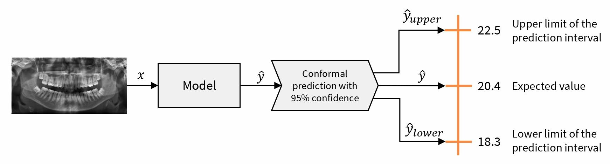

Welcome to my portfolio!

On this site I will keep a list of my personal technical challenges I've faced in Machine Learning, from training Deep Learning models to architecting robust Data Pipelines. Interested in Trustworthy AI, ensuring that data-driven systems are not just fast, but trustworthy.

<!-- Explore my projects to see how I leverage tools like PyTorch, Snowflake, and Quarto to turn raw data into intelligence. -->

Now, looking for a job 😉. Ready to join a tech team!

<!------------------------------------------------------------------------------------------------------------------------------->

## Bio

I am David González Durán, a recent graduate in Computer Science and Business Management from the University of Granada. 

During my Joint Honours Degree, I discovered my passion for AI, particularly Machine Learning. I realized that AI algorithms go far beyond code, acting as a bridge between complex information and strategic decision-making. This passion naturally led me to Data Science. I enjoy diving into datasets to uncover hidden insights and create visualizations that help us understand the reality behind the data. 

Apart from that, and thanks to a well-structured subject, I developed a strong interest in Computer Vision. This field allowed me to explore everything from classical image representation and filtering to handcrafted feature extraction. Eventually, I moved into deep learning architectures, focusing primarily on image classification while also exploring the power of transformers for image segmentation.

However, lately, I also found out that AI makes mistakes and inherits biases from human recollected data, too. As a result, I have become increasingly committed to the field of Trustworthy AI. I believe that for artificial intelligence to be truly useful in the real world, it must be transparent and robust.

My latest focus is Uncertainty Quantification, the core of my Final Degree Project: _Quantification of the uncertainty in machine learning model predictions for biologocal profile estimation problems_ (see more details below in [Projects](#sec-projects)). My work integrates Conformal Prediction into biological estimation tasks, such as age and sex estimation, delivering statitiscally guaranteed prediction intervals (at regression) and label sets (at classification), capturing uncertainty across cases.

Currently, I am reading _Interpretable Machine Learning_ by Cristoph Molnar, staying at the forefront of explainability and model transparency. 

<!------------------------------------------------------------------------------------------------------------------------------->

## Academic background 

- **Joint Honours Degree in Computer Science and Business Management, from 2019 to 2026.**\
Average score of 8.01 in Computer Science and 8.36 in Business Management.

<!------------------------------------------------------------------------------------------------------------------------------->

## Work experience {#sec-work-experience}

- Extracurricular internship as **Data Engineer in [**Cívica Software**](https://civica-soft.com/)** from July to October 2024 (3 months). 

<!------------------------------------------------------------------------------------------------------------------------------->

## Projects {#sec-projects}

- _**Quantification of the uncertainty in machine learning model predictions for biologocal profile estimation problems**_ [(link to repository)](https://github.com/esdavide2910/tfg-bioprofile-uncertainty) made in collaboration with [Panacea Cooperative Research](https://panacea-coop.com/), supervised by [Pablo Mesejo Santiago](https://www.ugr.es/~pmesejo/), and mentored by [Javier Venema Rodríguez](https://www.linkedin.com/in/javier-venema/). 

<!------------------------------------------------------------------------------------------------------------------------------->

## Skills and tools 

- 🤖 **Machine Learning & Data Research**: I specialize in the end-to-end Machine Learning lifecycle, from data acquisition to model optimization.
  - Advance use of **Pandas** and **Polars** for high-performance data manipulation and cleaning.
  - **Matplotlib**, **Seaborn** and **Plotly** to communicate complex insights through interactive and publication-quality graphics.
  - Expert use of **Scikit-Learn** for classical ML. Experienced with **PyTorch** and **TensorFlow** for deep learning implementation and familiarity with **ONNX** for model interoperability.
  - Specialized in uncertainty quantification using **Crepes**, **MAPIE**, and **TorchCP**.

- 📊 **Database Engineering and Analytics**:
  I hold an intermediate level in **SQL** (CTEs, Window Functions, Procedures...). Practical experience in enterprise environments focusing focusing on monitoring and maintenance of existing data structures:
  - **Data Warehousing**: Intermediate experience with **Snowflake** and **Teradata**, supervising analytical datasets and executing minor schema modifications. 
  - **ETL & Integration**: Experience (basic level) with **Informatica PowerCenter**. 
  - Intermediate expertise in **Power BI**.

- ✍️ **Technical Communication**:
  Clarity, order and reproducibility in documents are fundamental pillars of communication. 
  - **Scientific Typesetting**: Advanced use of **LaTeX** and **typst** for high-quality scientific documents and reports.
  - **Reproducible Publishing**: Building websites using **Quarto** (like this website page 😄).
  - **Collaborative Ecosystems**: Overleaf, Google Workspace and **Microsoft 365**.

- 🛠️ **Software Engineering**:
  - **Version Control**: Frequent use of **Git** and **GitHub** for collaborative development and code versioning.
  - **Containerization**: Basic experience with **Docker** for environment isolation for personal use.

- 💻 **Programming Languages**:
  - **Python**: High level. My primary language for data-intensive applications.
  - **C++** and **Java**: Intermediate level, used for general...
  - **R**: Basic level. Learning right now!

<!------------------------------------------------------------------------------------------------------------------------------->

## Interests
 
- **DataViz**: Focused on advanced exploratory data analysis (EDA) and the design of visualisations that help us understand data.

- **Trustworthy AI**: Interested in uncertainty quantification and explainable AI to build trustworthy systems and ensuring robustness in environments where reliability and risk quantification are paramount.

- **Open Source**: Convinced that open source is essential to democratize access to AI and accelerate technological progress, in addition to reducing dependence on propietary software.

<!------------------------------------------------------------------------------------------------------------------------------->

## References

Referenced by:

- [**Pablo Mesejo Santiago**](https://www.ugr.es/~pmesejo/), Associate Professor at the Department of Computer Science and Artificial Intelligence of the University of Granada and co-founding partner and Chief AI Officer at Panacea Cooperative Research.\

  <a href="documents/RecommendationLetter.pdf" class="btn btn-outline-primary" target="_blank">
    <i class="bi bi-file-earmark-pdf"></i> Download reference
  </a>

