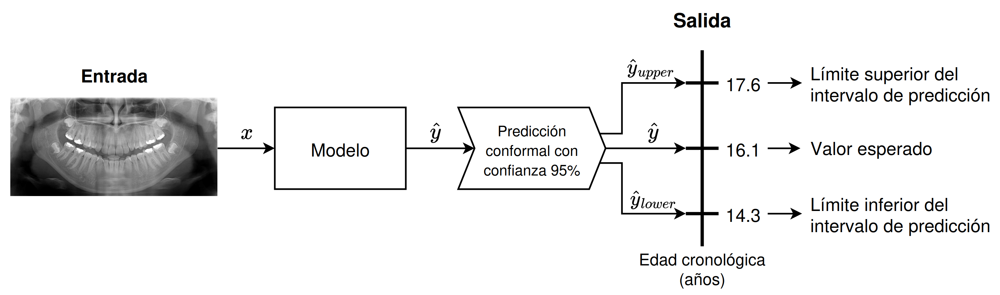

Welcome to my portfolio!

On this site I will keep a list of the...

<!------------------------------------------------------------------------------------------------------------------------------->

## Bio

I am David González Durán. I have recently graduated in Computer Science and Business Management from the University of Granada. 

During my double degree, I discovered my passion for AI, particularly Machine Learning. I realized that AI algorithms go far beyond what we code, acting as a bridge between complex information and strategic decision-making.

This passion naturally led me to Data Science. I love diving into datasets to uncover hidden insights and create visualizations that help us understand the reality behind the data. 

Apart from that, and thanks to a well-structured subject, I developed a strong interest in Computer Vision. This field allowed me to explore everything from classical image representation and filtering to handcrafted feature extraction. Eventually, I moved into deep learning architectures, focusing primarily on image classification while also exploring the power of transformers for image segmentation.

However, lately, I also found out that AI makes mistakes and inherits biases from data, too. So I have become increasingly committed to the field of Trustworthy AI. I believe that for artificial intelligence to be truly useful in the real world, it must be transparent and robust.

My latest focus has been Uncertainty Quantification, a topic explored in my Final Degree Project: _Quantification of the uncertainty in machine learning model predictions for biologocal profile estimation problems_ (see more details below in [Projects](#sec-projects)). This work integrates conformal prediction into biological estimation task, such as age and sex estimation, delivering statiscally guaranteed prediction intervals (at regression) and label sets (at classification), capturing uncertainty across cases.

At the moment, I'm reading _Interpretable Machine Learning_ by Cristoph Molnar. 

<!------------------------------------------------------------------------------------------------------------------------------->

## Academic background 

- **Doble Degree in Computer Science and Business Management, from 2019 to 2026.**\
Average score of 8.01 in Computer Engineering and 8.36 in Business Management.

<!------------------------------------------------------------------------------------------------------------------------------->

## Work experience {#sec-work-experience}

- Extracurricular internship as **Data Engineer in [**Cívica Software**](https://civica-soft.com/)** from July to October 2024 (3 months). 

<!------------------------------------------------------------------------------------------------------------------------------->

## Projects {#sec-projects}

- [Quantification of the uncertainty in machine learning model predictions for biologocal profile estimation problems](https://github.com/esdavide2910/tfg-bioprofile-uncertainty) made in collaboration with [Panacea Cooperative Research](https://panacea-coop.com/), and supervised by [Pablo Mesejo Santiago](https://www.ugr.es/~pmesejo/) and [Javier Venema Rodríguez](https://www.linkedin.com/in/javier-venema/).

<!------------------------------------------------------------------------------------------------------------------------------->

## Skills and tools

<!------------------------------------------------------------------------------------------------------------------------------->

## Interests
 
- **DataViz**: Focused on advanced exploratory data analysis (EDA) and the design of visualisations that help us understanding data.

- **Trustworthy AI**: Interested in uncertainty quantification and explanaible AI to build trustworthy systems and ensuring robustness in environments where reliability and risk quantification are paramount.

- **Open Source**: Convinced that open source is essential to democratize access to AI and accelerate technological progress, in addition to reduce dependence on propietary software.
