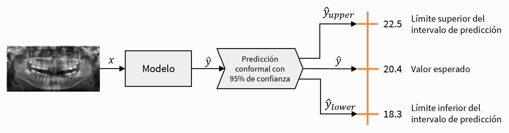

¡Bienvenido a mi portfolio!

En este sitio mantendré una lista de los desafíos técnicos personales a los que me he enfrentado en Machine Learning, desde el entrenamiento de modelos de Deep Learning hasta el diseño de arquitecturas robustas para Data Pipelines. Me interesa la IA Confiable (Trustworthy AI), asegurándome de que los sistemas basados en datos no sean solo rápidos, sino también dignos de confianza.

¡Actualmente estoy buscando trabajo! 😉 Listo para unirme a un equipo tecnológico.

<!------------------------------------------------------------------------------------------------------------------------------->

## Bio

Soy David González Durán, graduado recientemente en el Doble Grado de Ingeniería Informática y Administración y Dirección de Empresas por la Universidad de Granada.

Durante mi formación, descubrí mi pasión por la IA, concretamente por el Machine Learning. Me di cuenta de que los algoritmos de IA van mucho más allá del código: actúan como un puente entre la información compleja y la toma de decisiones estratégicas. Esta pasión me llevó de forma natural hacia la **Ciencia de Datos**. Mi base técnica se consolidó durante mis prácticas extracurriculares en [Cívica Software](https://civica-soft.com/), donde trabajé como **Junior Data Engineer** en un proyecto para una importante entidad financiera. Allí adquirí una experiencia fundamental en el ecosistema de bases de datos, lo que me permitió comprender el ciclo de vida y procesos ETL. Esta formación previa ha sido clave para mi enfoque actual: disfruto profundizando en conjuntos de datos para descubrir ideas ocultas y creando visualizaciones que nos ayuden a comprender la realidad que subyace a los datos.

Más tarde, y gracias a una asignatura muy bien estructurada, desarrollé un fuerte interés en la **Visión por Computador**. Este campo me permitió explorar desde la representación y el filtrado de imágenes clásicos hasta la extracción de características artesanales (handcrafted features). Finalmente, me adentré en arquitecturas de Deep Learning, centrándome principalmente en la clasificación de imágenes y explorando el potencial de los Transformers para la segmentación.

Sin embargo, también comprobé que la IA no es infalible, no solo porque comete errores objetivos, sino porque reproduce imprecisiones y sesgos sistémicos derivados de los conjuntos de datos recopilados por humanos. Como resultado, me he acercado cada vez más al campo de la **IA Confiable (_Trustworthy AI_)**. Creo que para que la inteligencia artificial sea realmente útil en el mundo real, debe ser transparente y robusta.

Mi enfoque más reciente en cuanto a esto es la **Cuantificación de la Incertidumbre**, el núcleo de mi Trabajo de Fin de Grado: _Cuantificación de la incertidumbre en las predicciones de modelos de machine learning para problemas de estimación del perfil biológico_ (ver más detalles abajo en [Proyectos](#sec-projects)). Este trabajo integra **Conformal Prediction** en tareas de estimación biológica, como la estimación de la edad y el sexo a partir de imágenes de imágenes de radiografías maxilofaciales, proporcionando intervalos de predicción (en regresión) y conjuntos de etiquetas (en clasificación) con garantías estadísticas, capturando así la incertidumbre en cada caso.

Actualmente, estoy leyendo _Interpretable Machine Learning_ de Christoph Molnar, para tener una visión más completa de cómo abrir la 'caja negra' de los algoritmos.

Más allá de lo académico, siempre he creído en la importancia de participar activamente en la comunidad universitaria. Durante mi grado, tuve el honor de servir durante 2 años como **secretario de la Delegación de Estudiantes de Ingenierías Informática y de Telecomunicaciones** (DEIIT). Durante esta etapa asumí la responsabilidad de convocar las sesiones plenarias, redacción y publicación de actas, gestión y actualización del censo de miembros, así como ayuda en la organización de eventos en la escuela (Granabot, Mercadillo de BBAA y Día de la Escuela).

<!------------------------------------------------------------------------------------------------------------------------------->

## Formación académica 

- **Doble Grado en Ingeniería Informática y Administración y Dirección de Empresas, por la Universidad de Granada, desde 2019 hasta 2026.**\
Nota media de 8.01 en Ingeniería Informática y 8.36 en Administración y Dirección de Empresas.

<!------------------------------------------------------------------------------------------------------------------------------->

## Experiencia laboral {#sec-work-experience}

- Prácticas extracurriculares como **Junior Data Engineer en [**Cívica Software**](https://civica-soft.com/)** de Julio a Octubre de 2024 (3 meses). 

<!------------------------------------------------------------------------------------------------------------------------------->

## Proyectos {#sec-projects}

- _**Cuantificación de la incertidumbre de las predicciones de modelos de aprendizaje automático en problemas de estimación del perfil biológico**_ [(link to repository)](https://github.com/esdavide2910/tfg-bioprofile-uncertainty) hecho en colaboración con [Panacea Cooperative Research](https://panacea-coop.com/), dirigido por [Pablo Mesejo Santiago](https://www.ugr.es/~pmesejo/) y mentorizado por [Javier Venema Rodríguez](https://www.linkedin.com/in/javier-venema/). 

<!------------------------------------------------------------------------------------------------------------------------------->

## Habilidades IT y recursos usados

- 🤖 **Machine Learning and Data Research**: Me especializo en todo el ciclo de vida del aprendizaje automático, desde la adquisición de datos hasta la optimización de modelos.
  - Uso avanzado de **Pandas** y **Polars** para la manipulación y limpieza de datos de alto rendimiento.
  - **Matplotlib**, **Seaborn** y **Plotly** para comunicar conocimientos complejos a través de gráficos interactivos y con calidad de publicación.
  - Uso experto de **Scikit-Learn** para el aprendizaje automático clásico. Experiencia con **PyTorch** y **TensorFlow** para la implementación de aprendizaje profundo y familiaridad con **ONNX** para la interoperabilidad de modelos.
  - Especializado en la cuantificación de la incertidumbre utilizando **Crepes**, **MAPIE**, and **TorchCP**.

- 📊 **Database Engineering and Analytics**:
  Tengo un nivel intermedio en **SQL** (CTEs, Window Functions, Procedures...). Experiencia práctica en entornos empresariales centrada en la supervisión y el mantenimiento de estructuras de datos existentes:
  - **Data Warehousing**: Experiencia intermedia con **Snowflake** y **Teradata**, supervisando conjuntos de datos analíticos y ejecutando modificaciones menores en los esquemas. 
  - **ETL & Integration**: Experiencia básica con **Informatica PowerCenter**. 
  - Conocimientos intermedios de **Power BI** para la visualización de datos.

- ✍️ **Comunicación técnica**:
  La claridad, el orden y la reproducibilidad en los documentos son pilares fundamentales de la comunicación. 
  - Uso avanzado de **LaTeX** y **typst** para la composición de documentos e informes científicos de alta calidad.
  - Creación de sitios web usando **Quarto** (como esta página web 😄).
  - **Ecosistemas colaborativos**: Overleaf, Google Workspace y Microsoft 365.

- 🛠️ **Software Engineering**:
  - **Version Control**: Uso frecuente de **Git** y **GitHub** para el desarrollo colaborativo y el control de versiones del código.
  - **Contenedorización**: Experiencia básica con **Docker** para el aislamiento de entornos de uso personal.

- 💻 **Lenguajes de programación**:
  - **Python**: Dominio avanzado en el desarrollo de aplicaciones de análisis de datos, visualización y despliegue de modelos de Machine Learning. Experiencia sólida en el ecosistema científico (Pandas, NumPy, Matplotlib/Seaborn) y en el desarrollo de flujos de trabajo eficientes para el procesamiento de información.
  - **C++** and **Java**: Nivel intermedio, usado durante la carrera para proyectos pequeños y medianos (Object-oriented programming).
  - **R**: Nivel básico. ¡Aprendiendo ahora mismo!

<!------------------------------------------------------------------------------------------------------------------------------->

## Intereses
 
- **DataViz**: Centrado en el análisis exploratorio de datos (EDA) y en el diseño de visualizaciones que nos ayuden a comprender los datos.

- **Trustworthy AI**: Interesados en la cuantificación de la incertidumbre y la IA explicable para crear sistemas fiables y garantizar la solidez en entornos donde la fiabilidad y la cuantificación del riesgo son fundamentales.

- **Open Source**: Convencidos de que el código abierto es esencial para acelerar el progreso tecnológico y reducir la dependencia del software propietario.

<!------------------------------------------------------------------------------------------------------------------------------->

## Recomendaciones

Recomendado por:

- [**Pablo Mesejo Santiago**](https://www.ugr.es/~pmesejo/), Profesor asociado del Departamento de Informática e Inteligencia Artificial de la Universidad de Granada y socio cofundador y director de Inteligencia Artificial de Panacea Cooperative Research.\

  <a href="documents/RecommendationLetter.pdf" class="btn btn-outline-primary" target="_blank">
    <i class="bi bi-file-earmark-pdf"></i> Download reference
  </a>

